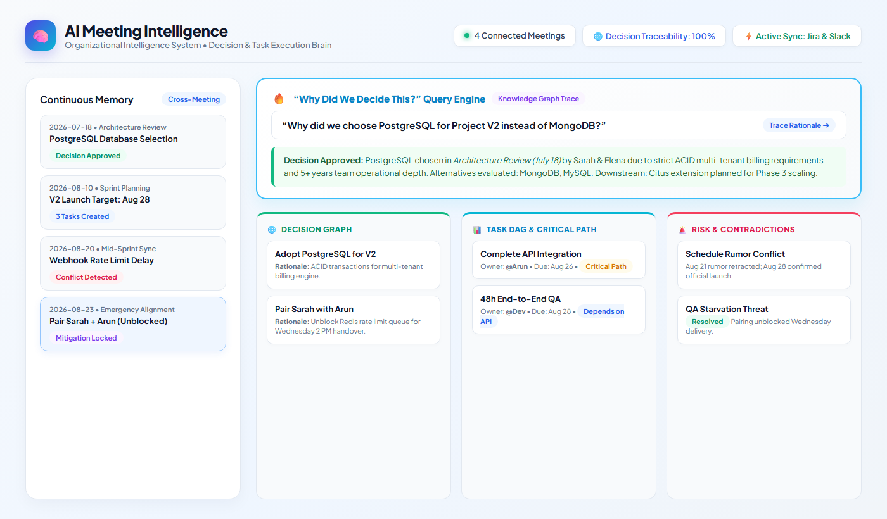
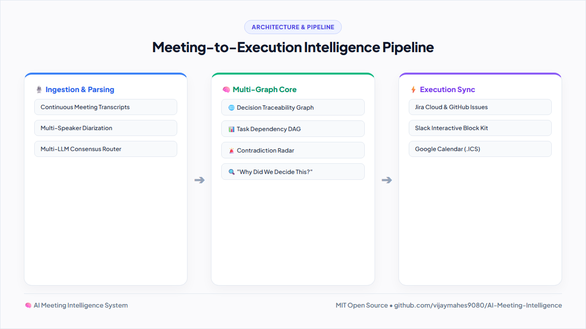

<div align="center">

# 🧠 AI Meeting Intelligence
### The Organizational Brain & Execution Layer

[](LICENSE)
[](https://nodejs.org)
[](https://python.org)
[](Dockerfile)
[](.github/workflows/ci.yml)

> **“Don’t just record what people said. Understand what the organization decided, what must happen next, why it matters, and what could go wrong.”**

<br>



</div>

---

## 🌟 Overview

**AI Meeting Intelligence** is not another passive audio recorder or basic transcription tool. It transforms conversations into a **structured, continuous organizational intelligence system** that links decisions, task dependency DAGs, cross-meeting fact contradictions, and downstream execution automations.

<div align="center">
  
</div>

---

## 🚀 Core Intelligence Layers

| Layer | Function | Output |
|:---|:---|:---|
| **🌐 Decision Graph** | Decisions, rationale, alternatives evaluated, stakeholders, downstream consequences | Fully traceable decision trees |
| **📊 Task Graph (DAG)** | Action items, ownership, deadlines, blockers, critical path | Dependency-aware execution plans |
| **🧠 Knowledge Graph** | People, Projects, Tech, Decisions, Tasks, Risks & cross-links | Unified organizational memory |
| **⚠️ Risk Radar** | Evaluates dependency cascades (e.g. API delay $\rightarrow$ QA delay $\rightarrow$ Launch slip) | Early warning severity scoring |
| **🚨 Contradiction Detector**| Temporal fact-checking between past & current meeting claims | Schedule conflict resolution |
| **🔍 "Why Did We Decide This?"** | Natural language graph traversal search with citations | Instant rationale retrieval |
| **⚡ Follow-up Automations** | Zero-friction sync with project management tools | Jira, Slack, GitHub & Calendar sync |

---

## 🔥 Killer Feature: “Why Did We Decide This?”

Users can query the organizational memory in plain English:
> **"Why did we choose PostgreSQL for Project V2?"**

**AI Response:**
* **Decision:** Adopt PostgreSQL as Primary Database for Project V2
* **Meeting:** Architecture Review – July 18, 2026
* **Rationale:** Strict ACID compliance for billing engine + 5+ years team operational depth
* **Alternatives Evaluated:** MongoDB, MySQL
* **Decision-Makers:** Sarah (Lead Architect) & Elena (Product Director)
* **Related Risks:** Database migration & sharding complexity
* **Follow-up Tasks:** Draft schema specification (Sarah), Dockerize cluster (Arun)
* **Citation:** *"Sarah: 'We evaluated MongoDB, MySQL, and PostgreSQL. PostgreSQL is our recommended choice because Project V2 demands strict ACID transaction compliance...'"*

---

## 📱 Social & Community Preview

<div align="center">
  
</div>

---

## 🏗️ Repository Structure

```
├── python/                         # Python Intelligence Engine
│   ├── app.py                      # Python REST API & Static Server
│   ├── core/
│   │   ├── decision_graph.py       # Decision hierarchies & traceability
│   │   ├── task_graph.py           # Dependency DAGs & critical path
│   │   ├── knowledge_graph.py      # Organizational knowledge graph
│   │   ├── risk_analyzer.py        # Risk cascades & severity scores
│   │   ├── contradiction_detector.py # Cross-meeting schedule conflicts
│   │   ├── query_engine.py         # "Why Did We Decide This?" search
│   │   ├── llm_router.py           # Multi-agent consensus & self-critique
│   │   ├── sentiment_analyzer.py   # Psychological safety & speaker balance
│   │   ├── meeting_roi.py          # Financial meeting cost & ROI calculator
│   │   ├── vector_store.py         # In-memory vector semantic RAG index
│   │   ├── report_exporter.py      # Markdown & executive brief generator
│   │   └── integrations/           # Slack, Jira, GitHub, Calendar sync
│   └── requirements.txt            # Python dependencies
├── server/
│   └── server.js                   # Node.js REST API & Web Server
├── public/                         # Modern Interactive Intelligence Studio
│   ├── index.html                  # Glassmorphic UI with 7 workspace views
│   ├── css/style.css               # Design system & dark-mode theme
│   └── js/
│       ├── app.js                  # Frontend controller & API client
│       ├── graphs.js               # D3.js force-directed graph engine
│       ├── audioVisualizer.js      # Canvas audio waveform visualizer
│       ├── decisionMatrix.js       # Multi-criteria decision radar
│       └── theme.js                # Dynamic theme customizer
├── data/
│   └── seedData.json               # 4 connected meetings with full memory
├── tests/
│   └── test_graphs.py              # Automated unit & integration tests
├── docs/
│   ├── ARCHITECTURE.md             # System architecture blueprint
│   ├── API.md                      # REST API reference specifications
│   └── images/                     # Light theme mockups & banners
├── linkedin.md                     # Ready-to-publish LinkedIn announcement
├── image.png                       # High-res LinkedIn post preview
├── Dockerfile & docker-compose.yml # Containerized deployment configs
└── .github/workflows/ci.yml        # Automated CI test pipeline
```

---

## ⚡ Quick Start

### Option 1: Run with Node.js
```bash
# Clone the repository
git clone https://github.com/vijaymahes9080/AI-Meeting-Intelligence.git
cd AI-Meeting-Intelligence

# Start the server
npm start
```
Open **[http://localhost:5000](http://localhost:5000)** in your browser.

---

### Option 2: Run with Python
```bash
# Install dependencies
pip install -r python/requirements.txt

# Start Python server
python python/app.py
```
Open **[http://localhost:8000](http://localhost:8000)** in your browser.

---

### Option 3: Run with Docker
```bash
docker-compose up --build
```
Open **[http://localhost:5000](http://localhost:5000)** in your browser.

---

## 🧪 Running Tests

```bash
# Run Python unit tests
python -m unittest discover -s tests -p "test_*.py"
```

---

## 📡 REST API Summary

| Method | Endpoint | Description |
|:---|:---|:---|
| `GET` | `/api/state` | Returns the unified organizational graph state |
| `POST` | `/api/query/why` | Natural language *"Why Did We Decide This?"* query engine |
| `POST` | `/api/meetings/process` | Ingests and processes new meeting transcripts in real time |
| `GET` | `/api/graphs/knowledge` | Returns nodes and edges for D3.js visualization |
| `POST` | `/api/automations/dispatch` | Dispatches tickets to Jira, Slack, or Google Calendar |

For complete payload documentation, see [**`docs/API.md`**](docs/API.md).

---

## 📄 License
This project is open-sourced under the [MIT License](LICENSE).

---

<div align="center">
  <b>Developed with ❤️ by <a href="https://github.com/vijaymahes9080">Vijay Mahes</a></b>
</div>
