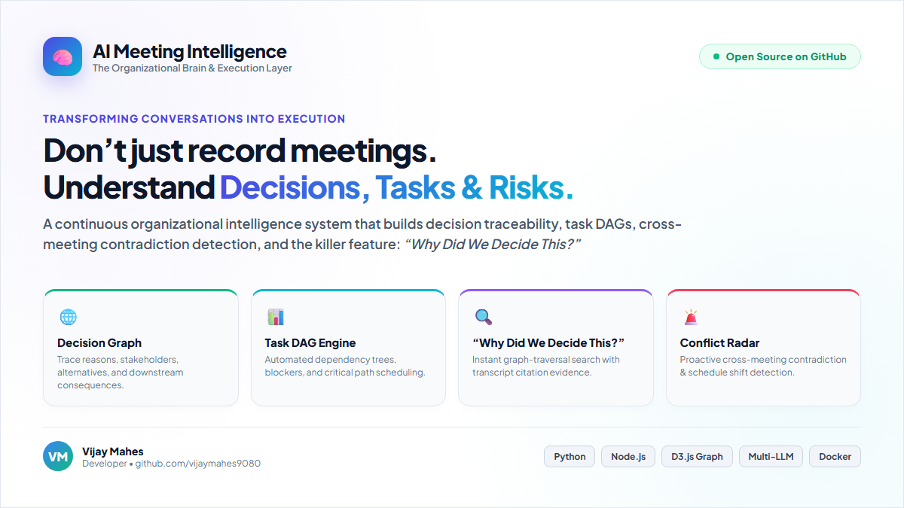

# 🚀 Announcing AI Meeting Intelligence: The Organizational Brain & Execution Layer 🧠⚡

Most meeting tools stop at recording what people said.
We built a system that understands **what the organization decided, what must happen next, why it matters, and what could go wrong.**

---

### 📸 Project Preview

---

### 💡 The Problem with Traditional Meeting Recorders
Recording 60 minutes of audio just produces a 10-page text dump that nobody reads. Organizations still struggle with:
- ❓ **Lost Decision Context:** *"Why did we choose PostgreSQL over MongoDB 3 weeks ago?"*
- ⛓️ **Missed Dependencies:** Arun’s API slips by 1 day $\rightarrow$ QA gets starved $\rightarrow$ Friday production release fails.
- 🚨 **Unnoticed Contradictions:** Meeting A claims *"Launch on Aug 28"*, while Meeting B assumes *"Launch on Aug 21"*.

---

### 🌟 What Makes AI Meeting Intelligence Different?

Instead of treating each meeting as an isolated event, **AI Meeting Intelligence** constructs a **continuous, connected organizational knowledge graph**:

1. 🌐 **Decision Graph & Traceability:**
   Trace every choice: `Decision ➔ Rationale ➔ Decision-Makers ➔ Stakeholders ➔ Alternatives ➔ Consequences`.
   
2. 📊 **Task Execution DAG:**
   Automatic dependency graphs, critical path identification, and blocker cascade alerts.

3. 🔍 **The Killer Feature: “Why Did We Decide This?”**
   Ask natural language questions across all historical meetings. The engine traverses the graph and returns the decision, rationale, evaluated alternatives, and exact transcript citations in milliseconds.

4. 🚨 **Cross-Meeting Contradiction Detector:**
   Proactively alerts teams when timelines or factual claims clash across cross-functional syncs.

5. ⚡ **Zero-Friction Execution Pipeline:**
   One-click bi-directional sync to **Jira Cloud**, **GitHub Issues**, **Slack Block Kit approvals**, and **Google Calendar (.ICS)**.

---

### 🛠️ Built With
- **Backend:** Python (FastAPI / Multi-Agent LLM Reasoning Pipeline) & Node.js
- **Visualization:** Interactive D3.js Force-Directed Graphs & Decision DAGs
- **NLP / Graph:** In-memory vector semantic cosine index + Multi-layer knowledge graph
- **Deployment:** Docker & GitHub Actions CI/CD

---

### 🔗 Explore the Open Source Project
- 🐙 **GitHub Repository:** [https://github.com/vijaymahes9080/AI-Meeting-Intelligence](https://github.com/vijaymahes9080/AI-Meeting-Intelligence)
- 📄 **Documentation & Architecture:** [https://github.com/vijaymahes9080/AI-Meeting-Intelligence/blob/main/docs/ARCHITECTURE.md](https://github.com/vijaymahes9080/AI-Meeting-Intelligence/blob/main/docs/ARCHITECTURE.md)

I'd love to hear your thoughts and feedback from engineering leaders, product managers, and developers! 👇

#ArtificialIntelligence #MachineLearning #SystemDesign #OpenSource #SoftwareEngineering #Python #NodeJS #D3JS #ProductManagement #Innovation #TechLeadership
